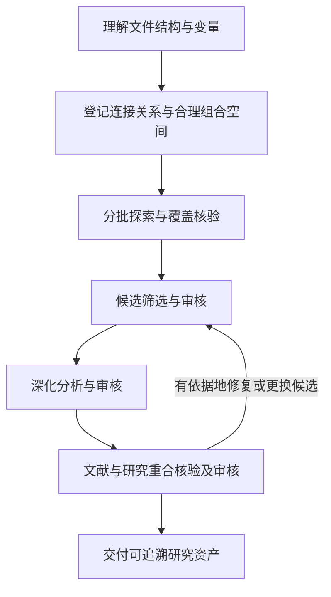

# Finance Empirical Research · 金融经济实证研究

面向异构本地数据的 Codex Skill：理解数据，按实际结构编写程序，系统探索合理关系，审核研究结果，并保存可检索、可追溯的研究资产。

An agent skill for data-aware empirical research in economics and finance. It combines adaptable, project-specific programming with explicit exploration coverage, inference safeguards, independent review, and lightweight handoff records. Instructions are primarily in Chinese; original variable names are preserved.

## 设计原则

- **理解数据再编程**：处理横表、竖表、多层表头和跨源连接时，由 Agent 判断结构；模块可以复用、改写或完全重写。
- **全量但不虚称无限**：登记有限、合理的组合空间，审核遗漏，保留显著、不显著、相反、失败及未完成结果。不是只挑 p 值最小的模型。
- **方法由研究问题决定**：区分描述、预测与因果；分别评估统计显著性、经济量级和识别可信度。
- **主窗口协调、分工审核**：候选筛选、深化分析和文献核验使用有明确范围的 subagent 审核；实际并发取决于宿主能力。
- **轻量交接**：通过短入口、结构化目录、输入指纹和定向检索恢复，不把历史研究笔记变成新流程指令。

## 安装

在支持 Skill Installer 的 Codex 中输入：

```text
使用 $skill-installer 从 https://github.com/Roleica/finance-empirical-research
安装 skills/finance-empirical-research 目录中的 Skill。
```

安装后选择 `finance-empirical-research`。若未出现，重启 Codex 后检查。GitHub 仓库安装方式参见 [官方 Skills 文档](https://learn.chatgpt.com/docs/build-skills)。本仓库是独立 Skill 源码包，不是已经上架的官方插件。

## 使用

建议先做数据理解，再确认探索范围；也支持直接授权全流程。

```text
使用 $finance-empirical-research。
输入范围：【本地数据目录】；输出目录：【新的独立目录】。
本轮只做数据理解和探索规划，识别文件结构、变量含义与可连接关系，
列出合理组合空间和预计计算规模，不运行全量回归。原始文件只读。
```

```text
使用 $finance-empirical-research。
输入范围：【本地数据目录】；输出目录：【新的独立目录】。
按全流程执行，根据实际数据编写代码，使用 subagent 审核。
原始文件只读，保留所有结果；计算资源上限：【时间、内存和并发限制】。
```

支持规划、数据理解、全量探索、候选深化、文献、审核、全流程和恢复八类模式。只执行本轮授权阶段；恢复时提供输出目录的 `START.md` 和 `run.json`。

## 工作流与文件



Skill 入口在 [SKILL.md](skills/finance-empirical-research/SKILL.md)。六份按需加载的参考文件分别说明数据、探索、推断、文献、协调和记录。唯一辅助程序 `scripts/ledger.py` 只负责 JSONL 检索、SHA-256 指纹和规格—结果状态对账，不是通用数据解析器或计量引擎。

```bash
python3 skills/finance-empirical-research/scripts/ledger.py query records.jsonl --query 中介 --fields id,status,method
python3 skills/finance-empirical-research/scripts/ledger.py coverage specs.jsonl results.jsonl
python3 skills/finance-empirical-research/scripts/ledger.py hash input.csv
```

检索默认最多返回 20 条。覆盖核验只能检查台账身份和状态，不能证明研究空间合理、数值正确或因果识别成立。

## 运行要求与验证范围

- 需要能够读取授权文件、编写和执行代码的 Agent 宿主。Skill 不绑定特定模型，也不保证所有宿主支持多智能体或同样的权限。
- 辅助脚本与公开测试仅使用 Python 标准库。统计分析所需 Python/R 库由 Agent 按数据与方法检查；不自动安装插件、改全局环境或购买服务。
- 维护者已用本地真实数据进行冷启动、结构适配、探索估计、数值交叉核对和交接试验；这些私有数据和试验记录不随仓库发布，不能视为公开可复现基准。
- 仓库公开测试使用合成记录，验证台账辅助功能和打包结构；不证明任意数据格式、DID、PPML、中介识别等全部能力均已实测。
- 探索结果仍须面对多重检验、选择偏差和外部验证；不保证显著结果、因果发现、全球创新性或论文录用。不提供无限后台运行保证。

本地运行公开测试：

```bash
python3 -m unittest discover -s tests -v
```

## 隐私与贡献

仓库不包含真实数据、研究结果、个人路径、API 密钥或原研究项目的 Git 历史。使用时把数据和生成输出放在仓库以外；提交 Issue 或 PR 前也请移除这些内容。建议用最小合成样例报告问题，并区分执行错误、统计方法问题和尚未测试的能力。

## 许可证

[MIT](LICENSE)。本项目为社区项目，不代表 OpenAI 官方产品或背书。
